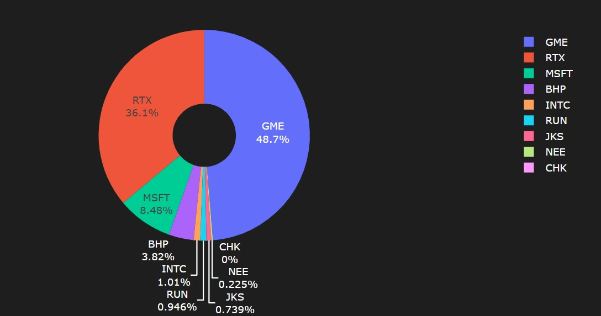
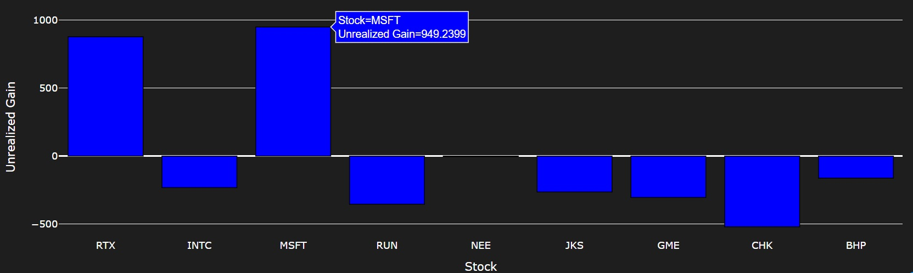

[](https://www.python.org) 
[](https://choosealicense.com/licenses/mit/)

# Portfolio Tracker

## Setup

1. Clone the repository:

```bash
git clone https://github.com/magurh/portfolio-tracker.git
cd portfolio-tracker
```

2. `uv` is used for dependency management. 
Follow the steps outlined in the [official documentation](https://docs.astral.sh/uv/getting-started/installation/#docker) for installation.
Whenever new dependencies are added, or for initial repository setup, run:

```bash
uv sync --all-extras
```

3. Add your transactions in the `data` folder, following the formatting instructions of the csv files.
Keep the same names for the spreadsheet files.
Make sure that all tickers are available for the `yfinance` package -- for instance, VUSA needs to be replaced by VUSA.AS.

4. Rename the `.env.dummy` file to `.env`.
If data is saved in a private subdirectory inside the `data` folder, name this subdirectory `private_data`, and set `PRIVATE_PATH` to `"private"` inside the env file.
Otherwise, no changes are needed to the environment variables.

5. Run the visualizer:

```bash
uv run python -m portfolio_tracker.app
```


Enjoy!

<p align="center">
  
</p>

<p align="center">
  
</p>


## Status and Notes

Stock Analytics:

* [x] Current portfolio dashboard: valuation and breakdown
* [x] Realized and unrealized gains from historic positions (FIFO method)
* [x] Separate tabs for stocks and index funds
* [ ] Portfolio performance over time and benchmark comparison
* [ ] Dividends and Commissions
* [ ] Tax calculation on capital gains

To be added at a later stage:

* [ ] Crypto assets
* [ ] Forex and cash positions

Fixes:

* [x] Stock splits: as the tracker is aware of stock splits, make sure that the transactions are not manually adjusted for those.
* [ ] Formatting for tables
* [ ] Renaming and/or delistings of tickers

## Extras 

To use Jupyter Lab, set the kernel to the fast-updates-monitoring environment created by poetry:

```bash
uv run python -m ipykernel install --user --name=portfolio-tracker
```

One can open Jupyter lab using `poetryuv run jupyter lab`. 
To add new dependencies, use: `uv add <dependency>`.

